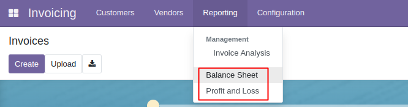
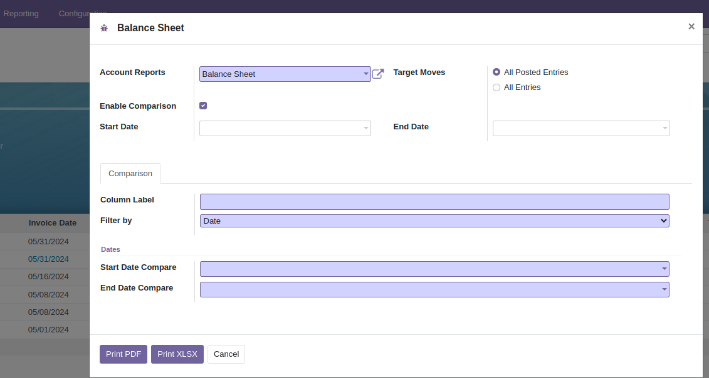

# Account Balance Sheet Report

This module enables printing of both the Balance Sheet Report and the Profit and Loss Report.

**Table of contents**

- [Overview](#overview)
- [Configuration](#configuration)
- [Usage](#usage)
- [Bug Tracker](#bug-tracker)
- [Maintainer](#maintainer)

## Overview

- Within the reporting menu, you have the option to print either the Balance Sheet or Profit and Loss statement based on
  your requirements. 
- In the Balance Sheet submenu, you can input necessary details for printing, such as the start and end dates.
  Additionally, you can apply a comparison filter if needed or choose to display solely debit or credit columns.
  
- Similarly, in the Profit and Loss submenu, you can provide essential information for printing, including start and end
  dates. Additionally, you have the option to apply a comparison filter or select to display only debit or credit
  columns. 

## Configuration

You don't need a specific configuration.

## Usage

## Bug Tracker

Bugs are tracked on [Gitlab Issues](https://gitlab.com/WellKnot/odoo/account/issues)

In case of trouble, please check there if your issue has already been reported. If you spotted it first, help us smash
it by providing detailed and welcomed feedback.

## Maintainer

This module is maintained by WellKnot.

To contribute to this module, please visit [Contributing Page](https://gitlab.com/WellKnot/extra/wikis/Contributing).
